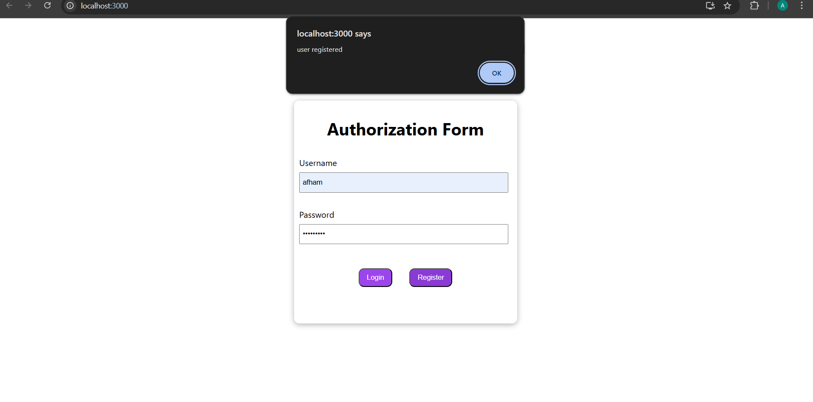
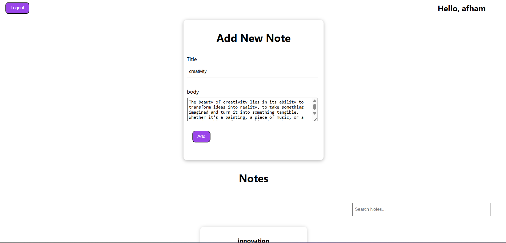
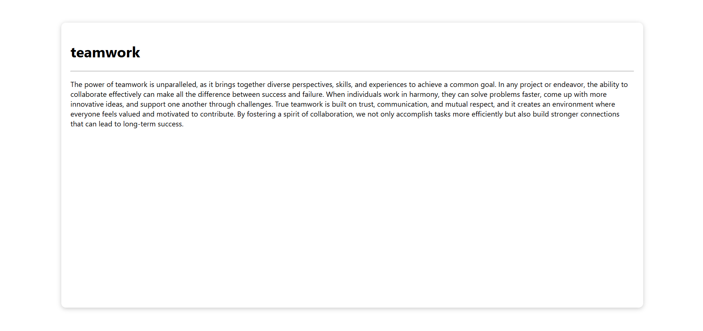
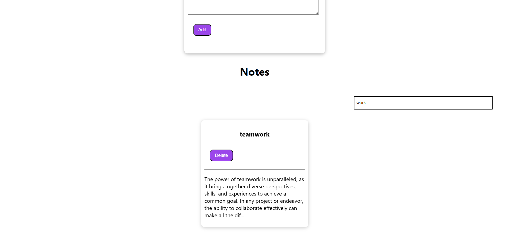
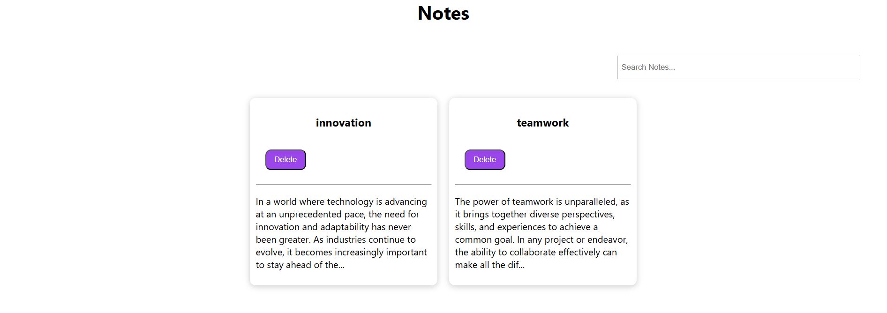

# Notes App - MERN Stack

A simple Notes app built using the **MERN** stack (MongoDB, Express, React, Node.js). This app allows users to create, view, update, and delete notes.

## Features
- **User Authentication:** Sign up, login, and manage sessions with JWT.
- **Create, Read, Update, Delete Notes:** Perform CRUD operations on notes.
- **Secure Data:** All data is stored securely in MongoDB, and authentication is handled with JWT tokens.
- **Responsive UI:** A simple and intuitive frontend built with React.

## Tech Stack
- **Frontend:** React.js
- **Backend:** Node.js with Express
- **Database:** MongoDB
- **Authentication:** JSON Web Token (JWT)
- **State Management:** React hooks 

